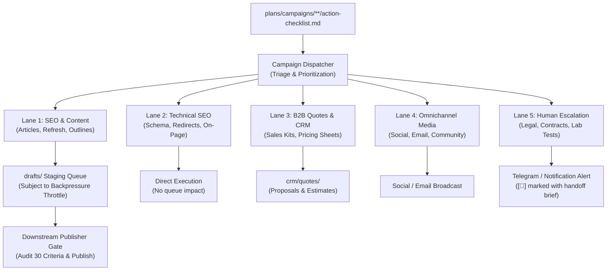

# Campaign Dispatch & Closed-Loop Execution Protocol

Closed-loop campaign execution protocol. Bridges the critical gap between strategy/planning (`/mk:plan`, `/mk:campaign`, `/mk:seo campaign`, trend radaring) and production/publishing. Ensures 100% of tasks defined in campaign checklists are systematically dispatched, executed, audited, and closed without task abandonment or downstream bottlenecks.

**Trigger:** `node scripts/campaign-dispatcher.js [--execute-next] [--limit=N]` (or manual dispatch via `/mk:campaign dispatch`)  
**Agents:** `campaign-dispatcher` / `campaign-manager` (orchestration) · `seo-writer` (Lane 1) · `seo-technical` (Lane 2) · `sales-consultant` (Lane 3) · `social-writer` (Lane 4) · Human Escalation (Lane 5)  
**Required input:** `plans/campaigns/**/action-checklist.md`  
**Output dir:** `wiki/drafts/` (or `content/drafts/`) for content, direct live execution for technical tasks  
**State:** `action-checklist.md` with standard Progress Overview table and task state machine (`[ ]` open, `[🔄]` in progress, `[x]` done).

---

## 1. The Planning-to-Publishing Problem

In multi-agent marketing operations, workflows frequently suffer from **execution decoupling**:
- Planners and researchers generate elaborate campaign plans, keyword clusters, and audit recommendations.
- Downstream publishers only review finished drafts immediately ready for publishing.
- **The Gap**: No systematic dispatcher exists to break the plan into bounded batches, prepare data feeds, sanitize formulas, route tasks to appropriate specialists, and monitor SLA deadlines. Checklists become stale "zombie documents" that nobody executes.

This protocol closes that gap by introducing **autonomous, capacity-aware dispatching**.

---

## 2. Multi-Lane Task Routing (5 Specialized Lanes)

Every task extracted from `action-checklist.md` is classified and routed into one of five operational lanes:



| Lane | Focus | Target Agents | Output Destination | Queue Impact |
|---|---|---|---|---|
| **Lane 1: Content Production** | New articles, content refresh, FAQ structuring | `seo-writer`, `copywriting` | `drafts/<slug>.md` | High (fills staging queue) |
| **Lane 2: Technical SEO** | JSON-LD schema, 301 redirects, internal link graph, HTML fix | `seo-technical`, `seo-schema` | Direct CMS/code update | None (bypasses draft queue) |
| **Lane 3: B2B CRM & Quotes** | Price sheet lookup, wholesale proposals, sales kits | `b2b-sales-consultant`, CRM skills | `crm/quotes/<quote-id>.md` | None |
| **Lane 4: Omnichannel Media** | Social posts, video scripts, newsletter campaigns | `social-writer`, `emails` | `social/posts/`, email provider | Low |
| **Lane 5: Human Escalation** | Physical tests, legal review, contract signoff | Human Operator | Task marked `[🔄]` + ping alert | External |

---

## 3. Micro-Batching & Downstream Capacity Balancing

### The Downstream Bottleneck Principle
Downstream editorial review and publishing capacity is strictly bounded:
- Human and automated quality gates require rigorous checks (content depth, factual verification, brand design, image licensing, schema validity).
- Search engines penalize abrupt mass publishing (crawl budget exhaustion, algorithmic spam filters). Safe publishing velocity is typically **1 to 3 articles per day**.

### Batch Sizing Limits
1. **Content Lane (Lane 1)**:
   - Max **1 to 2 drafts per dispatch run** (`--limit=1` or `--limit=2`).
   - Max **2 to 4 drafts per day** across morning and afternoon shifts.
2. **Technical & Internal Link Lane (Lane 2)**:
   - Batch size: **3 to 5 tasks per run** (executed directly; zero burden on editorial review).

---

## 4. Backpressure Throttle Control (Capacity Guard)

To prevent draft staging queues from turning into unmanageable backlogs, the dispatcher enforces an automatic **Backpressure Throttle**:

- **Queue Capacity Threshold**: Safe queue size is **< 4 unreviewed drafts** in `drafts/`.
- **Throttling Trigger**: If `drafts/` contains **≥ 4 unreviewed drafts**:
  1. Emit a high-visibility warning: `[BACKPRESSURE CONTROL] Queue has reached capacity threshold`.
  2. **Halt new article generation** (block Lane 1 execution).
  3. **Reroute capacity**: Automatically pivot dispatch runs to Lane 2 (Technical, Schema, Internal Link fixes) or Lane 3.
  4. Notify downstream publishers to drain the queue before new drafts are created.

---

## 5. Workload Dynamics: High-Volume vs. Low-Volume Scenarios

### Scenario A: High Workload / Surge (20–50+ Tasks Backlog)
When backlogs grow due to broad audits or multi-pillar campaign launches:
1. **Strict Priority Queueing**: Order of execution is strictly enforced:
   $$\text{P0 (Urgent, <24h SLA)} \longrightarrow \text{P1 (Target, <7d SLA)} \longrightarrow \text{P2 (Long-term / Silo)}$$
2. **Micro-Batching Protection**: Even with 50 tasks waiting, the dispatcher only pulls `--limit=N` items per run. It **never** floods the workspace with unreviewed drafts.
3. **Automated SLA Watchdog**: Scheduled runs flag any P0 task uncompleted after 24 hours with an escalated notification to the team channel.

### Scenario B: Low Workload / Idle (0–3 Tasks Open)
When all urgent tasks are resolved:
1. **Evergreen Elevation Mode**: When `openP0 == 0` and `openP1 == 0`, the dispatcher automatically targets P2 backlog items:
   - **Striking Distance Keywords**: Optimize articles ranking in positions 11–20 to push them into Top 10.
   - **Thin Content Thickening**: Enrich short articles (<1,000 words) with technical specs and FAQ blocks.
   - **FAQ / AI Search Structuring**: Add natural Q&A headings for Google AI Overview / GEO visibility.
2. **Zero-Spam Rule (Zero-Task State)**:
   - When 100% of checklist tasks are marked `[x]`, the dispatcher enters **Passive Health Watchdog** mode.
   - It performs passive structural integrity checks and reports green status.
   - **Hard Rule: NEVER fabricate artificial tasks or spam low-value content** simply because the agent has an active shift.

---

## 6. Folder Governance & Campaign Packaging Standard

Every campaign must be self-contained within `plans/campaigns/` under strict structural rules:

```
plans/campaigns/
├── README.md                              # Master index of all campaigns
└── <domain-or-category>/<campaign-name>/  # Self-contained campaign directory
    ├── master-campaign-plan.md            # Strategy, KPIs, root causes, RACI, acceptance criteria
    └── action-checklist.md                # Execution tracking with Progress Overview & Task IDs
```

### Action Checklist Specification
Every `action-checklist.md` must include:
1. **Progress Overview Table** at the top:
   | Module | Scope | Task Range | Total Tasks | Status |
   |---|---|---|:---:|:---:|
   | M1 | Core Architecture | `ACT-01` – `ACT-05` | 5 | `[x] 5/5` |
   | M2 | Content Refresh | `ACT-06` – `ACT-10` | 5 | `[🔄] 2/5` |
2. **Strict Tri-State Markers**: `[ ]` (Open), `[🔄]` (In Progress), `[x]` (Completed).
3. **Explicit Task IDs**: Every row must carry a traceable identifier (e.g. `ACT-01`, `P0-SEO-01`).

---

## 7. CLI Command Reference (Human-AI Parity)

Both human developers and automated orchestrators use the exact same CLI commands:

```bash
# Dashboard & Inspection
node scripts/campaign-dispatcher.js                        # View total progress dashboard
node scripts/campaign-dispatcher.js --list-p0              # View all urgent P0 tasks
node scripts/campaign-dispatcher.js --list-all             # View all open tasks grouped by priority
node scripts/campaign-dispatcher.js --next                 # Inspect next highest-priority task

# Execution Engine
node scripts/campaign-dispatcher.js --execute-next         # Auto-execute next 1 task
node scripts/campaign-dispatcher.js --execute-next --limit=2 # Batch execute next 2 tasks
node scripts/campaign-dispatcher.js --execute=<TASK_ID>    # Auto-execute specific task by ID

# Status Management
node scripts/campaign-dispatcher.js --mark-done=<TASK_ID>  # Mark task [x] and recalculate summary
node scripts/campaign-dispatcher.js --mark-in-progress=<ID># Mark task [🔄]
node scripts/campaign-dispatcher.js --mark-open=<TASK_ID>  # Revert task to [ ]

# Automated Monitoring
node scripts/campaign-dispatcher.js --watchdog             # Audit SLA deadlines & emit alerts
node scripts/campaign-dispatcher.js --notify               # Send formatted progress report
node scripts/campaign-dispatcher.js --dry-run              # Simulation mode (no file mutations)
```
