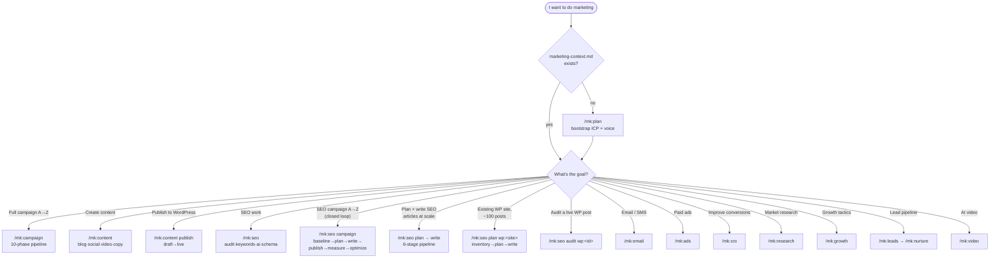
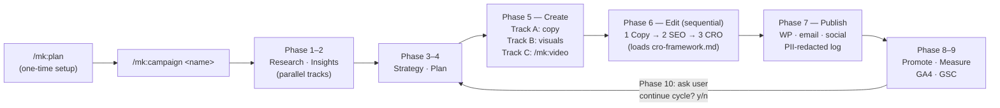
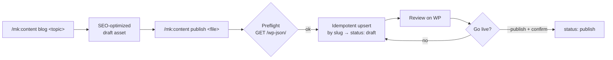
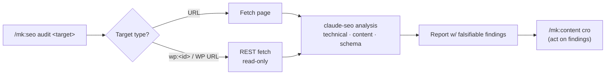
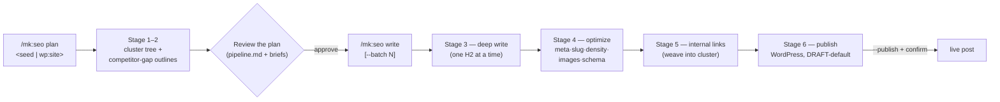
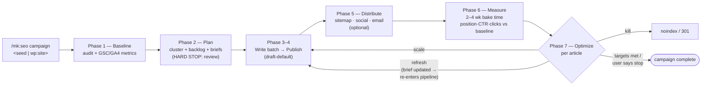
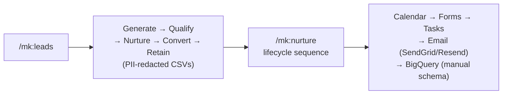

# 🎯 ClauKit Marketing Kit — Guide

> Everything to automate marketing — from campaign planning to community engagement — inside Claude Code via the `/mk:` namespace.

Install with `ck init --kit marketing` (or `--kit both`). Adds **51 marketing skills, 12 agents, 12 commands, 6 workflows, 5 MCP wrappers, WordPress publishing**.

> **The marketing rule**: `/mk:plan` once → it writes the context hub (`plans/marketing-context.md`) → every other `/mk:` command reads from it. Plan once, run many. Every `/mk:` command **except** `/mk:plan` hard-fails without the hub.

For the full kit reference (skill list, agents, MCP setup, source repos) see [`skills/marketing/README.md`](./skills/marketing/README.md).

---

## 1. Introduction

The marketing kit turns Claude Code into a full marketing team. It ships:

- **Curated skills** — SEO (via `AgriciDaniel/claude-seo`, 25 sub-skills + 18 agents), the `seo-writing` article-production pipeline (seed keyword → published article), content, email/SMS, paid ads, CRO, research, growth, lead pipeline, AI video.
- **A context hub** — `plans/marketing-context.md` (ICP, positioning, brand voice, competitors, goals, channels) — the single source of truth keeping every output on-brand.
- **Gated, idempotent automation** — draft-by-default publishing, PII redaction, deterministic keys so re-runs never duplicate sends.
- **Bring-your-own MCP** — GA4, GSC, SendGrid, Resend, ReviewWeb, WordPress — each with a manual fallback so the kit works with zero MCP servers configured.

---

## 2. Who it's for

| User | Use case | Commands |
|---|---|---|
| **Solo founder** | Full campaign cycle without an agency | `/mk:plan` + `/mk:campaign` |
| **SMB shop owner** | Content + ads at scale | `/mk:content` + `/mk:ads` |
| **Marketing manager** | Standardized, repeatable process | All 6 workflows |
| **Agency** | Client delivery framework | All commands + workflows |
| **B2B SaaS** | Lead pipeline | `/mk:leads` + `/mk:nurture` |
| **Content creator** | Multi-platform content | `/mk:content` + `/mk:video` |
| **E-commerce** | Product + ads | `/mk:ads` + `/mk:cro` |
| **Local business** | Local SEO | `/mk:seo` + `seo-local` skill |

**Service domains**: real estate, e-commerce, SaaS, edtech, F&B, healthcare/clinic, agencies, freelancers, B2B services, content creators.

---

## 3. How to use — workflows

### 🧭 Decision tree — which command do I need?



---

### Flow 1 — 🚀 Full campaign (the flagship)

`/mk:campaign` runs the complete 10-phase pipeline — research → insights → strategy → plan → create → edit → publish → promote → measure → optimize (loops back to strategy, user confirms each cycle).



**When to use**: you want the whole machine. For a single asset, reach for the focused commands instead. Sub-workflows (`/mk:leads`, `/mk:nurture`, `/mk:video`) are orchestrated by this pipeline — campaign name is passed automatically.

---

### Flow 2 — ✍️ Content → WordPress publish

Generate SEO content, then push it to a live WordPress site. **Draft by default** — going live is an explicit, confirmed step.



**Env required**: `WP_SITE_URL`, `WP_USER`, `WP_APP_PASSWORD` (Application Password — env only, never hardcoded). Re-publishing updates the same post by slug — **never duplicates**. Optional MCP server via the `mcp-wordpress` skill; falls back to the curl REST path automatically.

---

### Flow 3 — 🔎 SEO audit (incl. live WordPress posts)

Routes through the `AgriciDaniel/claude-seo` engine (25 sub-skills + 18 agents in parallel). Audit a URL **or a live WordPress article** by id/URL — fetched read-only, then analyzed.



**Read-only**: the audit path never writes to your site. Fixes come back as recommendations; applying them goes through the separate publish flow.

---

### Flow 3b — ⭐ SEO article pipeline (plan → write → publish, at scale)

Where the audit flow *analyzes*, the **`seo-writing`** pipeline *produces* — seed keyword (or an existing site) → published, optimized, interlinked articles. It's a 6-stage assembly line with a status machine, ported from a production n8n workflow, driven by the `seo-writer` agent. `plan` stops for review; `write` produces drafts.



**Key guarantees:** truth-only (no placeholder entities / invented stats), deep section-by-section writing (the quality lever over one-shot prompts), draft-default publishing (idempotent by slug — never duplicates), and resumable state in `plans/marketing/<site>/pipeline.md` (any stage re-runs without redoing the rest).

**Signature case — existing WordPress site (~100 posts, mediocre SEO):** `/mk:seo plan wp:<site>` runs the full playbook — inventory + triage the existing posts (read-only), map them onto a target cluster, prioritize the gaps (improve-before-create), then batch-write and publish. Research plugs into Exa / DataForSEO / SerpAPI when available, falls back to WebSearch/WebFetch.

**Trigger like the n8n workflow (bulk queue):** seed the backlog once (`/mk:seo plan "<seed>"`), then drip articles with `/loop 30m /mk:seo write --batch 1` — the loop equivalent of the n8n Schedule Trigger picking the next `new` keyword each run.

---

### Flow 3c — 🔁 SEO campaign (the closed loop)

Flow 3b *produces* articles; **`/mk:seo campaign`** runs SEO as a full campaign — it adds the "before" (baseline audit + GSC/GA4 metrics) and the "after" (measurement, then scale / refresh / kill decisions that loop back into writing). Driven by [`.claude/workflows/seo-workflow.md`](./.claude/workflows/seo-workflow.md) (7 phases).



**When to use**: the goal is *organic growth over cycles* — you want the before/after numbers and a standing refresh loop, not just a batch of articles. Each cycle asks the user before continuing; state lives in the same `pipeline.md`, so `campaign` and standalone `plan`/`write` runs interoperate.

---

### Flow 4 — 📈 Lead pipeline (B2B)



**When to use**: SaaS / B2B with a funnel. `/mk:leads` runs the 5-phase pipeline; `/mk:nurture` drives the lifecycle sequence per lead stage. Both are orchestrated by `/mk:campaign` when running the full pipeline, or usable standalone (each prompts for campaign name).

---

## 4. Use cases — scenario → command

| Scenario | Command | Chain after |
|---|---|---|
| 🔧 First-time setup (ICP, voice) | `/mk:plan [-o md\|html]` | → any `/mk:` command |
| 🚀 Full campaign | `/mk:campaign <name>` | (end-to-end pipeline) |
| ✍️ Blog / social / video / copy | `/mk:content [blog\|social\|video\|copy]` | → `/mk:content publish` |
| 📤 Publish to WordPress | `/mk:content publish <file> [--publish]` | (draft → live) |
| 🔎 SEO audit / keywords / schema | `/mk:seo [audit\|keywords\|ai\|schema]` | → `/mk:content cro` |
| 🔁 SEO campaign, closed loop | `/mk:seo campaign <seed\|wp:site>` | (baseline → … → optimize loop) |
| ⭐ Plan SEO articles (cluster + backlog) | `/mk:seo plan <seed\|wp:site>` | → `/mk:seo write` |
| ✍️ Write + publish SEO articles | `/mk:seo write [<id>\|--batch N] [--publish]` | (draft → live) |
| 🔍 Audit a live WP post | `/mk:seo audit wp:<id>` | (read-only) |
| 📧 Email & SMS | `/mk:email` | (campaign · cold · drip · sms) |
| 📢 Paid ads | `/mk:ads` | (google · meta · creative · a/b) |
| 🎯 Conversion optimization | `/mk:cro` | (audit · landing · signup) |
| 🔬 Market research | `/mk:research` | → `/mk:plan` (refine ICP) |
| 🌱 Growth tactics | `/mk:growth` | (launch · referral · free-tool) |
| 📈 Lead pipeline | `/mk:leads` | → `/mk:nurture` |
| 🎬 AI video | `/mk:video` | (script → render → distribute) |

### Real-world playbooks

Concrete, end-to-end scenarios — copy the command sequence and adapt the bracketed values.

**1. SaaS pillar-content SEO campaign** — build a topic cluster around one pillar keyword and produce the whole cluster via the article pipeline.
```
/mk:plan                                  # set ICP + brand voice (once)
/mk:seo audit https://yoursaas.com        # technical + content + schema baseline
/mk:seo plan "<pillar keyword>"           # SERP → cluster tree + prioritized write backlog (review)
/mk:seo write --batch 3                    # deep-write next 3 articles, optimized + interlinked (draft)
/mk:seo write <slug> --publish            # publish one live on WordPress (after confirmation)
```

**2. Local business — get found on Google Maps.** Restaurant/clinic/salon wants local-pack visibility.
```
/mk:plan                                  # ICP = local customers, service area
/mk:seo audit https://yourshop.com        # routes seo-local + seo-maps sub-skills
/mk:content blog "best <service> in <city>"
/mk:seo schema <file>                     # LocalBusiness JSON-LD
```

**3. E-commerce product launch.** New product line, need ads + landing that convert.
```
/mk:research competitor "<competitor>"    # angle + positioning gaps
/mk:content copy "<product> launch page"
/mk:cro audit <landing-file>              # 25-point CRO pass
/mk:ads google "<product>"                # + /mk:ads meta for social
```

**4. B2B cold-outreach + nurture.** Fill the funnel, then warm leads to a demo.
```
/mk:leads                                 # generate → qualify → nurture → convert → retain
/mk:email cold "<ICP segment>"            # cold sequence
/mk:nurture                               # lifecycle drip per lead stage (PII-redacted)
```

**5. Content creator — repurpose one idea across channels.** One topic → blog + social + video.
```
/mk:content blog "<topic>"
/mk:content social "<topic>"              # platform-native variants
/mk:video "<topic>"                       # script → voiceover → visuals → render
```

**6. Audit & fix an underperforming live post.** A published article that isn't ranking.
```
/mk:seo audit wp:<post-id>                # read-only audit of the live WP post
/mk:content cro <exported-draft>          # rewrite per falsifiable findings
/mk:content publish <file> --publish      # upsert by slug — never duplicates
```

**6b. Existing WordPress site — scale content the right way.** ⭐ ~100 posts, mediocre SEO, no cluster structure. Inventory first, then fill the gaps and interlink.
```
/mk:plan                                  # ICP + brand voice (once)
/mk:seo plan wp:<yoursite.com>            # inventory + triage 100 posts → cluster map + gap backlog
                                          #   (stops for review — this IS the "kế hoạch viết bài")
/mk:seo write --batch 3                    # batch deep-write the gap articles (draft)
/mk:seo write --batch 3 --publish         # publish live in controlled batches (idempotent by slug)
/loop 6h /mk:seo write --batch 1          # optional: drip the backlog on a schedule (n8n-style)
```
One-command variant: `/mk:seo campaign wp:<yoursite.com>` runs the same sequence **plus** a metrics baseline up front and a measure → scale/refresh/kill loop after publishing (Flow 3c).

Artifacts land in `plans/marketing/<site>/`: `inventory.md` (triaged posts), `pipeline.md` (the ordered plan), `briefs/`, `articles/`. Improve-before-create — fixing near-miss existing posts is the cheapest win. Research uses Exa/DataForSEO when configured, WebSearch/WebFetch otherwise.

**7. Agency client onboarding.** Spin up a repeatable delivery framework per client.
```
/mk:plan full                             # full ICP/positioning interview for the client
/mk:research market                       # TAM/SAM/SOM + competitor deep-dive
/mk:campaign <client-name>                # full 10-phase pipeline, gated each cycle
```

**8. Re-engage a dormant email list.** Win back subscribers who went cold.
```
/mk:email drip "<win-back angle>"         # re-engagement sequence
/mk:cro email <sequence-file>             # optimize subject lines + CTAs
```

**9. Quick weekly social cadence.** Solo founder posting consistently without a calendar tool.
```
/mk:content social "<this week's theme>"  # batch a week of platform-native posts
```

**10. Pre-launch waitlist growth.** Build buzz before a product is live (greenfield, no site yet).
```
/mk:plan                                  # ICP + positioning from scratch
/mk:growth launch "<product>"             # launch tactics + free-tool ideas
/mk:content copy "<waitlist landing>"
/mk:email campaign "<launch announcement>"
```

### Patterns at a glance

**Context hub first**: `/mk:plan` writes `plans/marketing-context.md`. No hub → every other `/mk:` command refuses to run. This is by design — it forces a single source of truth for ICP/positioning/voice so all output stays on-brand.

**SEO is parallel**: `/mk:seo` doesn't run one checker — it dispatches up to 15 claude-seo sub-skills simultaneously, then synthesizes. Every finding ships with a *falsifiability check* ("how would we know this failed?").

**SEO writing is a staged pipeline**: `/mk:seo plan` and `/mk:seo write` drive the `seo-writing` assembly line (strategy → outline → deep-write → optimize → link → publish) via the `seo-writer` agent. It's staged, gated, idempotent, and resumable — `plan` stops for review before writing burns tokens; state lives in `pipeline.md` so any stage re-runs alone. Truth-only (no fabricated entities/stats) and draft-default publishing apply throughout.

**WordPress is draft-safe**: publishing is outward-facing and hard to reverse, so `/mk:content publish` always writes a **draft** first. Live publish requires `--publish` + an explicit confirmation echoing the target URL + title. Re-runs upsert by slug (idempotent).

**MCP optional, fallback always**: GA4, GSC, SendGrid, Resend, ReviewWeb, and WordPress all have MCP wrappers — but each has a **manual fallback** (CSV paste, template generation, curl path). The kit works without any MCP server configured.

**Idempotent by design**: every automation uses a deterministic key (`campaign-name + step + recipient-id`) — re-running a campaign never duplicates sends. Phase 10 optimize loop always asks the user before starting the next cycle.

---

> Full kit reference — command list, agents, workflows, MCP setup, source repos — in [`skills/marketing/README.md`](./skills/marketing/README.md).
