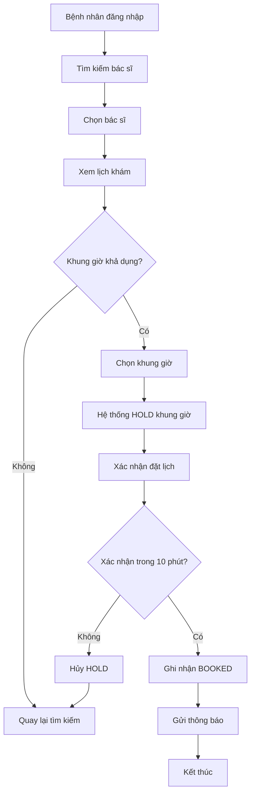

<!-- ba-deliverable: bp · class: owned · nguồn: plans/ba/demo/entities/ -->

# BP — Đặt lịch hẹn

## Tóm tắt (narrative)

Quy trình đặt lịch hẹn cho phép bệnh nhân tìm kiếm, chọn khung giờ khám với bác sĩ, và xác nhận đặt lịch thông qua hệ thống booking trực tuyến. Quy trình này giúp tối ưu hóa lịch làm việc của bác sĩ và cung cấp trải nghiệm thuận tiện cho bệnh nhân. Sau khi xác nhận thành công, hệ thống ghi nhận lịch hẹn và gửi thông báo xác nhận đến bệnh nhân.

## Vai trò & tác nhân (roles/actors)

| Vai trò | Trách nhiệm | Hệ thống sử dụng |
|---|---|---|
| Bệnh nhân | Tìm kiếm bác sĩ, chọn khung giờ, xác nhận lịch hẹn | Web/Mobile Booking System |
| Bác sĩ | Cập nhật lịch khám, phê duyệt lịch | Admin Portal |
| Hệ thống Booking | Hiển thị khung giờ, giữ chỗ, ghi nhận lịch hẹn | Appointment Module |
| Dịch vụ Notification | Gửi thông báo xác nhận qua SMS/email | SMS/Email Gateway |

## Kích hoạt (trigger)

Bệnh nhân khởi động quy trình bằng cách truy cập hệ thống booking và chọn mục "Đặt lịch hẹn" hoặc nhấp vào một bác sĩ cụ thể để xem lịch khám của họ.

## Đầu vào / Đầu ra (inputs/outputs)

| Đầu vào | Nguồn |
|---|---|
| Thông tin bác sĩ | Danh sách bác sĩ trong hệ thống |
| Lịch khám còn trống | Database lịch của bác sĩ |
| Thông tin bệnh nhân (đã đăng nhập) | Hệ thống xác thực |

| Đầu ra | Đích |
|---|---|
| Thông báo xác nhận lịch hẹn | Email/SMS bệnh nhân |
| Bản ghi lịch hẹn (BOOKED) | Database appointments |

## Các bước (steps)

1. **Bệnh nhân** mở ứng dụng booking và đăng nhập.
2. **Bệnh nhân** tìm kiếm bác sĩ theo chuyên khoa hoặc tên.
3. **Hệ thống** hiển thị danh sách bác sĩ phù hợp.
4. **Bệnh nhân** chọn một bác sĩ cụ thể để xem lịch khám (thực hiện UC-001).
5. **Hệ thống** hiển thị các khung giờ còn trống trong 7 ngày tới.
6. **Bệnh nhân** chọn một khung giờ.
7. **Hệ thống** giữ chỗ (HOLD) khung giờ đó trong 10 phút (thực hiện FR-011).
8. **Bệnh nhân** kiểm tra thông tin lịch hẹn được đề xuất.
9. **Bệnh nhân** bấm "Xác nhận đặt lịch" để hoàn tất (thực hiện UC-004).
10. **Hệ thống** ghi nhận lịch hẹn với trạng thái BOOKED (thực hiện FR-012).
11. **Dịch vụ Notification** gửi thông báo xác nhận qua SMS/email.

## Quy tắc nghiệp vụ (business rules)

- FR-011: Bệnh nhân chọn khung giờ khám còn trống — hệ thống phải giữ chỗ khung giờ trong 10 phút để bệnh nhân hoàn tất xác nhận.
- FR-012: Bệnh nhân xác nhận đặt lịch hẹn — sau khi xác nhận, trạng thái khung giờ thay đổi từ HOLD thành BOOKED và không còn sẵn cho bệnh nhân khác.

## Ngoại lệ (exceptions)

- **Bước 6 → Khung giờ được chọn bị khóa**: Nếu trong khi bệnh nhân chọn khung giờ, khung giờ đó đã bị bệnh nhân khác đặt, hệ thống thông báo và quay lại danh sách khung giờ còn trống.
- **Bước 7 → Hết thời gian giữ chỗ**: Nếu bệnh nhân không xác nhận trong vòng 10 phút, hệ thống tự động hủy HOLD và khung giờ trở nên sẵn cho bệnh nhân khác.
- **Bước 10 → Lỗi hệ thống**: Nếu hệ thống gặp lỗi khi ghi nhận lịch hẹn, thông báo lỗi được hiển thị cho bệnh nhân và khung giờ vẫn ở trạng thái HOLD.

## Sơ đồ

[UNRENDERED]

