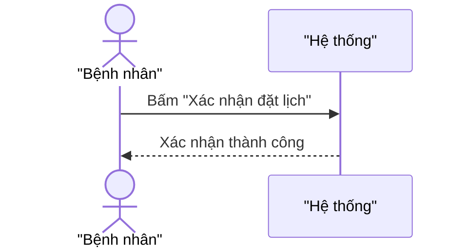
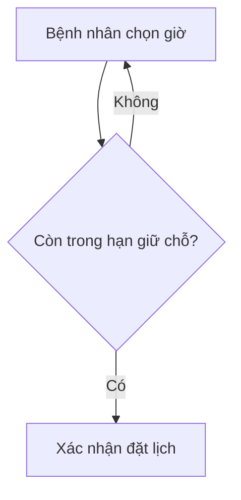
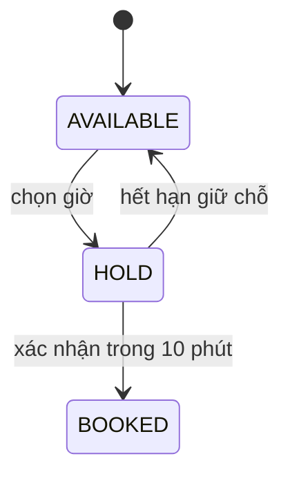
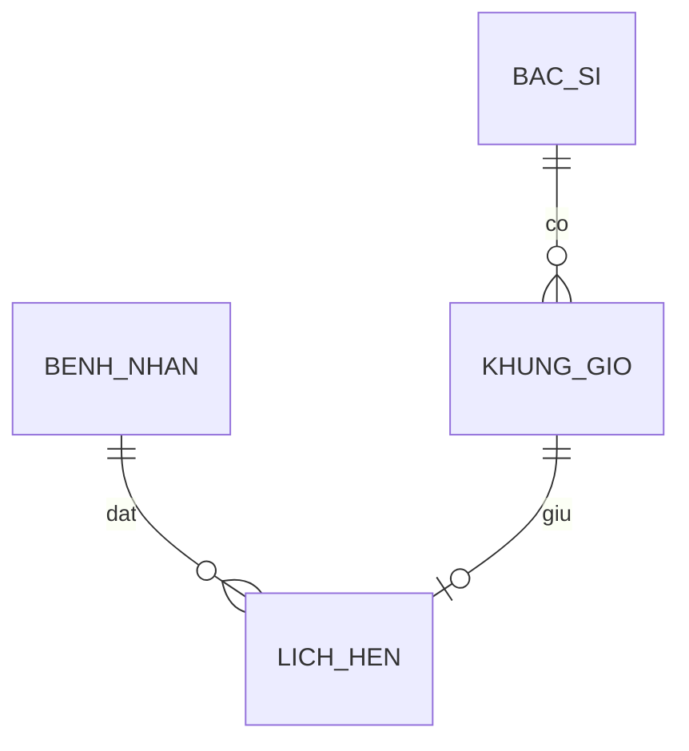

# Mermaid patterns — one known-good block per type

Four minimal blocks, one per type, hand-checked against the mermaid grammar (this machine has no
`mmdc` to compile them — see the render gate in `../SKILL.md`). Copy the shape, not the content.

## The diacritic-quoting rule

Quote every node/participant label that carries a Vietnamese diacritic:
`A["Bệnh nhân chọn giờ"]`, never `A[Bệnh nhân chọn giờ]`. This is the single most common mermaid
syntax failure for this kit's output — an unquoted bracket label containing certain
punctuation-adjacent characters can break the parser; a quoted string never does. Applies to
`flowchart` node labels and `sequenceDiagram` participant aliases; `erDiagram` entity/attribute
names are plain identifiers (no diacritics, no quoting question).

## `sequence`



## `flow`



## `state`



## `erd`



## The `[UNRENDERED]` header — verbatim, every degraded artifact

Open the file with exactly this block when no renderer is reachable, so every degraded artifact
looks identical:

```
> **[UNRENDERED]** — no mermaid renderer available (`mmdc` absent on this machine). Source below is syntax-authored, not compiled. Re-run through `npx -y @mermaid-js/mermaid-cli` (or paste into a renderer that supports mermaid) before treating this as verified.
```

Then a one-line caption naming the source entities, then the ` ```mermaid ` fence.
