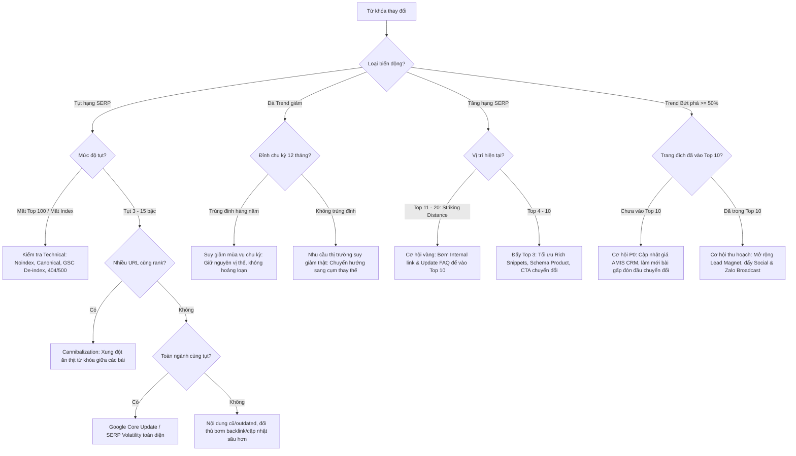

# SEO & Marketing Strategy Consultant Framework (SKILL)

> **"Không đo lường cảm tính — Mọi tư vấn chiến lược phải bắt nguồn từ dữ liệu từ khóa thay đổi thật và mục tiêu doanh thu thương mại."**

Skill này cung cấp phương pháp luận, công cụ tự động hóa và quy chuẩn báo cáo dành cho **Cố Vấn Chiến Lược SEO & Marketing**, giải quyết 3 bài toán trọng tâm:
1. **Chỉ rõ chính xác từ khóa nào thay đổi** (tăng hạng, tụt hạng, bứt phá nhu cầu, suy giảm mùa vụ, rớt Top 100, mới xuất hiện).
2. **Chẩn đoán nguyên nhân gốc rễ** đằng sau mỗi biến động (thuật toán Google, intent trôi dạt, ăn thịt từ khóa - cannibalization, suy giảm chất lượng nội dung, hay chu kỳ thị trường).
3. **Tư vấn chiến lược marketing & hành động SEO cụ thể** (phân bổ nguồn lực P0 / P1 / P2, tối ưu tỷ lệ chuyển đổi CRO, làm mới nội dung, liên kết Silo, phân phối đa kênh qua Zalo OA/Social).

---

## 1. Khi Nào Kích Hoạt Skill Này

- **Định kỳ:** Sau các ca trực đo lường SERP của Khánh (`serp-campaign-planner`, Thứ Hai & Thứ Năm 08:30 ICT) và ca trực Trend Radar của Lâm (`market-trend-radar`, Chủ Nhật 06:00 ICT hàng tuần).
- **Đột xuất:** Khi có biến động thuật toán Google (Core Update / Helpful Content / Spam Update), khi doanh số một nhóm sản phẩm sụt giảm, hoặc khi Ban Giám Đốc yêu cầu báo cáo chiến lược SEO & Marketing tổng thể.
- **Khẩu lệnh mẫu:**
  - *"Báo cáo và tư vấn chiến lược SEO chu kỳ này, chỉ rõ từ khóa nào thay đổi."*
  - *"Đánh giá biến động thứ hạng tuần qua và đề xuất kế hoạch marketing tương ứng."*
  - *"Chạy tư vấn chiến lược SEO đa website: `node scripts/seo-strategy-consultant.js`."*

---

## 2. Khung Nhận Diện & Phân Loại Từ Khóa Thay Đổi (Keyword Delta Framework)

Mọi báo cáo chiến lược bắt buộc phải có **Bảng Đối Chiếu Biến Động Từ Khóa (Keyword Movement Matrix)**, phân tách rõ 6 nhóm trạng thái thay đổi:

| Nhóm biến động | Tiêu chí nhận diện kỹ thuật | Bản chất chiến lược | Mức ưu tiên mặc định |
|---|---|---|:---:|
| 🚀 **Bứt phá (Breakout)** | Trend momentum ≥ +50% hoặc SERP nhảy vọt ≥ 10 bậc | Nhu cầu thị trường tăng vọt hoặc Google đánh giá cao vượt bậc | **P0** (nếu ngoài Top 10) / **P1** |
| 📈 **Đang lên (Rising / Striking)** | SERP tăng lên Top 4 – 20 hoặc Trend momentum tăng ≥ +15% | Cận kề ngưỡng chuyển đổi cao (Trang 1 / Top 3) | **P1** |
| 📉 **Cảnh báo tụt hạng (Declining)** | Tụt khỏi Top 10 hoặc giảm ≥ 3 bậc trên từ khóa thương mại | Nguy cơ mất lưu lượng mua hàng vào tay đối thủ | **P0** (nếu mất Top 10) / **P1** |
| ❌ **Rớt Top / Mất dấu (Lost)** | Từng xếp hạng nhưng nay rớt khỏi Top 100 hoặc mất Index | Lỗi kỹ thuật nghiêm trọng hoặc bị phạt thuật toán | **P0** |
| 🆕 **Mới xuất hiện (New Entrants)** | Từ khóa mới vào bảng theo dõi hoặc mới vào Top 100 | Cơ hội khai phá chủ đề mới hoặc từ khóa phụ tự lên hạng | **P2** |
| ⚔️ **Ăn thịt từ khóa (Cannibalization)** | 2+ URL trên cùng domain cạnh tranh nhau cùng 1 từ khóa | Tiêu hao PageRank, làm loãng tín hiệu xếp hạng | **P1** |

### Cấu trúc thông tin bắt buộc cho mỗi từ khóa thay đổi:
1. **Tên từ khóa**: Cụm từ tìm kiếm chính xác.
2. **Website chủ quản**: `example.com`, `example.net` hoặc `example.org`.
3. **Dữ liệu trước vs sau**:
   - Vị trí SERP cũ → Vị trí SERP mới (kèm Δ Rank).
   - Đà Trend cũ → Đà Trend mới (kèm % Momentum).
4. **Ý định tìm kiếm (Search Intent)**:
   - `Transactional` (Báo giá, mua bán, đơn giá sỉ tại kho, chiết khấu).
   - `Commercial Investigation` (So sánh, thông số kỹ thuật, COA/MSDS, ASTM).
   - `Informational` (Khái niệm, cấu tạo, nguyên lý, quy chuẩn QCVN).
5. **Chẩn đoán nguyên nhân (Root Cause)**: Kỹ thuật / Thuật toán / Nội dung lỗi thời / Mùa vụ / Đối thủ cạnh tranh.
6. **Mức độ ưu tiên hành động**: P0 (Khẩn cấp 24-48h) · P1 (Chu kỳ tuần 7 ngày) · P2 (Trung hạn 30 ngày).
7. **Hành động can thiệp đề xuất**: Chỉ định rõ URL mục tiêu, phương án tối ưu On-page, Internal Link, giá AMIS CRM, hoặc chiến dịch phân phối.

---

## 3. Cây Chẩn Đoán Nguyên Nhân Gốc Rễ (Root Cause Diagnostic Tree)



---

## 4. Ma Trận Phân Bổ Ưu Tiên Hành Động (P0 / P1 / P2)

| Cấp độ | Tiêu chí kích hoạt | Thời gian xử lý | Hành động trọng tâm |
|:---:|---|:---:|---|
| **P0<br>Khẩn cấp** | • Từ khóa Transactional doanh thu cao bị tụt khỏi Top 10.<br>• Từ khóa bứt phá Trends ≥ +50% nhưng bài viết chưa vào Top 10.<br>• Trang đích chính bị mất Index Google hoặc lỗi kỹ thuật 4xx/5xx. | **24h – 48h** | • Khắc phục lỗi index ngay lập tức bằng `submit-google-indexing.js`.<br>• Làm mới bài viết mục tiêu: cập nhật bảng giá AMIS CRM, cải tổ tiêu đề H1/H2.<br>• Họp khẩn đội ngũ nội dung để ra mắt bản cập nhật trong 48h. |
| **P1<br>Trọng tâm** | • Từ khóa ở vùng cận Top (Striking Distance: vị trí #4 – #20) đang có đà tăng.<br>• Hiện tượng ăn thịt từ khóa (Cannibalization) giữa 2 bài cùng site.<br>• Bài viết trụ cột (Pillar) thiếu internal link từ các bài vệ tinh. | **3 – 7 ngày** | • Điều hướng liên kết nội bộ (Internal Link Silo) từ 3 – 5 bài vệ tinh dồn sức mạnh về bài chính.<br>• Bổ sung Schema FAQPage / Product kỹ thuật.<br>• Cài canonical hoặc sáp nhập 2 bài xung đột intent. |
| **P2<br>Trung hạn** | • Từ khóa suy giảm mùa vụ (cần giữ chân vị thế chuẩn bị cho chu kỳ sau).<br>• Mở rộng cụm chủ đề vệ tinh mới cho các từ khóa tiềm năng.<br>• Tái sử dụng nội dung (Repurposing) sang kênh Social, Video E-E-A-T, Zalo OA. | **15 – 30 ngày** | • Lên dàn bài cụm chủ đề vệ tinh 5 – 10 bài mới.<br>• Soạn tin nhắn Zalo OA chăm sóc tệp khách hàng B2B theo chủ đề nóng.<br>• Xây dựng Case Study dự án EPC thực tế để củng cố E-E-A-T. |

---

## 5. Ràng Buộc Chiến Lược Bắt Buộc (Rules of Engagement)

1. **Ràng Buộc Giá MISA AMIS CRM (`CLAUDE.md` §2.6)**:
   - Mọi đề xuất cập nhật bài viết báo giá hoặc tư vấn thương mại **bắt buộc phải lấy giá chuẩn từ MISA AMIS CRM** (`wiki/crm/products/amis-products.json`).
   - Tuyệt đối không tự ý giả định hay đưa ra con số giá niêm yết không có căn cứ.
2. **Ràng Buộc Chống Tự Triệt Tiêu Đa Website (Anti-Cannibalization `CLAUDE.md` §3.A)**:
   - `example.com`: Chỉ sở hữu từ khóa Than hoạt tính B2B, giá sỉ, than Ấn Độ cont, than buồng sơn.
   - `example.net`: Chỉ sở hữu từ khóa Vật liệu lọc nước cấp & công nghiệp (cát sỏi, quặng mangan, hạt cation, cột composite).
   - `example.org`: Chỉ sở hữu từ khóa Dịch vụ môi trường, xử lý nước thải & tổng thầu EPC.
   - Khi phát hiện từ khóa chệch Search Intent, tư vấn chiến lược phải chỉ định chuyển quyền sở hữu hoặc đặt liên kết ngữ nghĩa một chiều.
3. **Ràng Buộc Format Xuất Bản (`CLAUDE.md` §1.1 & §2.3 & §2.4)**:
   - Không đưa emoji vào nội dung xuất bản production.
   - Không để mã LaTeX thô (`	ext{...}`) hoặc khối Schema JSON thô trong thân bài.
   - Tin nhắn Zalo OA phải sạch Markdown (`**...**`).

---

## 6. Công Cụ Hỗ Trợ Tự Động Hóa (`scripts/seo-strategy-consultant.js`)

Chuyên viên tư vấn có thể chạy công cụ phân tích tự động để quét toàn bộ dữ liệu SERP và Trends mới nhất:

```bash
# Phân tích tổng thể 3 website và in báo cáo chiến lược ra màn hình
node scripts/seo-strategy-consultant.js

# Phân tích riêng 1 website cụ thể
node scripts/seo-strategy-consultant.js --site=site-c
node scripts/seo-strategy-consultant.js --site=site-b
node scripts/seo-strategy-consultant.js --site=site-a

# Xuất báo cáo tự động lưu vào plans/marketing/reports/strategy/
node scripts/seo-strategy-consultant.js --save
```

---

## 7. Mẫu Báo Cáo Tư Vấn Chiến Lược Chuẩn (Executive Strategic Report)

Xem chi tiết hướng dẫn tại:
- [`references/keyword-delta-framework.md`](references/keyword-delta-framework.md) — Hướng dẫn phương pháp luận đo lường và tính delta.
- [`references/executive-report-template.md`](references/executive-report-template.md) — Khung mẫu báo cáo chiến lược chuẩn cho Ban Giám Đốc.
